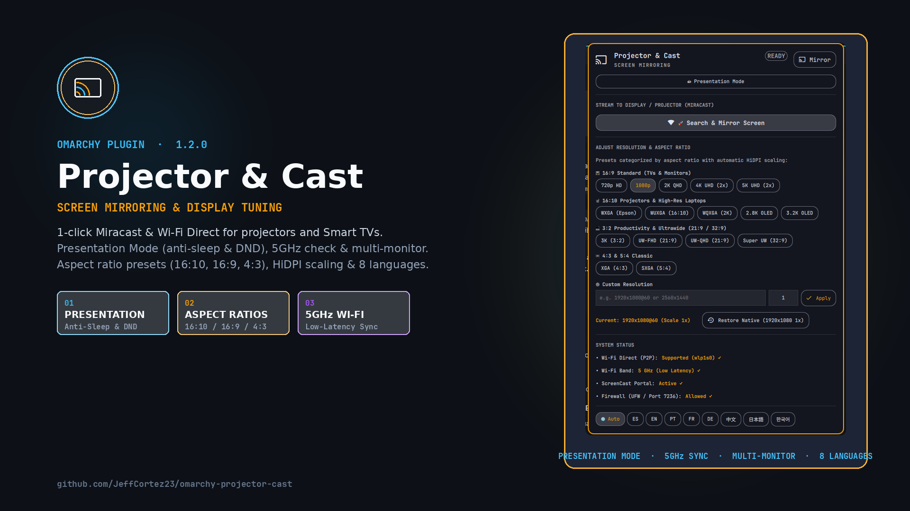

# 📽️ Projector & Cast — Omarchy Status Bar Plugin

[](https://omarchy.org)
[](LICENSE)
[](I18n.js)

**Projector & Cast** (`io.github.jeffcortez23.omarchy-projector-cast`) is a bar widget and popup panel for **Omarchy Linux** and **Hyprland**. It enables 1-click screen mirroring (Miracast / Wi-Fi Direct) to classroom/auditorium projectors (such as Epson 3LCD laser projectors) and Smart TVs (TCL, Samsung, LG, Sony), with instantaneous resolution switching, intelligent HiDPI auto-scaling, and extensive multi-aspect ratio presets (16:9, 16:10, 3:2, 21:9, 32:9, 4:3).



---

## ✨ Features

* **📡 1-Click Screen Mirroring (Miracast):** Seamlessly launches and manages `gnome-network-displays` with automatic PipeWire video streaming over Wi-Fi Direct (P2P).
* **🛡️ Presentation Mode (Anti-Sleep & DND):** 1-click toggle that inhibits desktop sleep/idle lock and silences desktop notifications during slide presentations.
* **⚡ Smart Wi-Fi Band & Portal Diagnostics:** Real-time detection of 5 GHz vs 2.4 GHz bands with low-latency tips, ScreenCast portal readiness check, and non-privileged firewall verification.
* **🖥️ Multi-Monitor Target Selection:** Easily select which connected display to resize or project when using multi-monitor setups.
* **🖱️ Top Bar Quick Action:** Right-click on the bar icon to instantly stop casting or reset to native resolution without opening the popup.
* **📐 Multi-Aspect Ratio & Resolution Presets:**
  * **16:9 Standard (TVs & Monitors):** `1080p FHD`, `2K QHD (1.25x)`, `4K UHD (2x HiDPI)`, `5K UHD (2x HiDPI)`, `720p HD Ready`.
  * **16:10 Classroom Projectors & High-Res Laptops:** `WXGA (Epson 1280x800)`, `WUXGA (1920x1200)`, `2.8K OLED (2880x1800 1.5x)`, `3.2K OLED (3200x2000 1.6x)`, `WQXGA (2560x1600 1.25x)`.
  * **3:2 Productivity (Surface / MateBook):** `3K (3000x2000 1.5x)`.
  * **21:9 & 32:9 Ultrawide:** `UW-FHD (2560x1080)`, `UW-QHD (3440x1440 1.25x)`, `Super UW (5120x1440 1.25x)`.
  * **4:3 / 5:4 Classic:** `XGA (1024x768)`, `SXGA (1280x1024)`.
* **🔄 Hardware-Aware Native Auto-Detection:** Automatically detects any laptop or monitor's exact factory resolution and HiDPI scale (1080p, 2.8K, 3.2K, 4K, 5K, ultrawide) and provides a 1-click restore.
* **🌐 Multilingual Support (i18n):** Auto-detects system locale or allows quick manual switching between **English (EN)**, **Español (ES)**, **Português (PT)**, **Français (FR)**, **Deutsch (DE)**, **中文 (ZH)**, **日本語 (JA)**, and **한국어 (KO)**.
* **🪟 Hyprland Universal Compatibility:** Supports Omarchy's Lua runtime API with fallback to standard Hyprland keyword dispatching.

---

## 📦 Prerequisites

1. **GNOME Network Displays** (for Miracast wireless casting):
   ```bash
   sudo pacman -S gnome-network-displays
   ```

2. **Hyprland Window Rule (Recommended):**
   To keep the connection window floating and centered, add this rule to `~/.config/hypr/hyprland.lua`:
   ```lua
   o.window({ class = ".*[nN]etwork[dD]isplays.*" }, { float = true, center = true, size = "800 580" })
   ```
   *(Or in standard `hyprland.conf`: `windowrule = float, class:.*[nN]etwork[dD]isplays.*`)*

3. **Firewall (UFW - Optional):**
   If UFW is active on your machine, allow the RTSP streaming port (7236/tcp):
   ```bash
   sudo ufw allow 7236/tcp comment 'Miracast-RTSP'
   ```
   *(The plugin includes a 1-click clipboard button in the UI if UFW is detected active).*

---

## 🚀 Installation & Removal

### Installation via Omarchy CLI
```bash
omarchy plugin add https://github.com/JeffCortez23/omarchy-projector-cast --enable
```

### Removal
```bash
omarchy plugin remove io.github.jeffcortez23.omarchy-projector-cast --yes
```

---

## 📜 License
MIT License © 2026 Jeff Cortez
